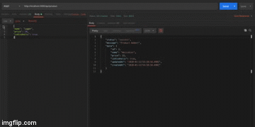

# BEER QUEEN - API

"Burger Queen" refere-se ao projeto desenvolvido durante o bootcamp da Laboratória, que tinha por obejtivo o aprendizado a construção de um _servidor web_, capaz de manejar as requisições que lhe são enviadas, devolvendo respostas ao cliente. 

***
## Índice 
1. [Resumo do Projeto](#1-resumo-do-projeto)
2. [Como Usar](#2-como-usar)
3. [Tecnologias Envolvidas](#3-tecnologias-do-projeto)
***
## 1. Resumo do Projeto

"Beer Queen" é o servidor web que pode ser futuramente implementa ao restaurante "God Save the Queen - Burger & Beer". 
O projeto consiste em um servidor web capaz de "ouvir" o que acontece em uma aplicação através de uma porta de rede, pela qual é possível enviar as _requests_ (requisições) e obter _responses_ (respostas), seguindo o modelo de arquitetura MVC (Model View Controller).
O projeto foi desenvolvido partindo de um _boilerplate_ fornecido que continha a [estrutura básica](https://github.com/Laboratoria/SAP003-burger-queen-api).

***

### 2. Como Usar

Dentro da pasta do projeto e tendo-se o NodeJs e Docker devidamente instalados é possível subir a aplicação através do comando: 

   docker-compose up <ambiente>

Podendo ser os ambientes: _db_, _dev_ ou _test_ (para rodar os testes de integração). 
A aplicação se encontra 
[hospedada no Heroku](https://beer-queen.herokuapp.com). 

Endpoints disponíveis:

HTTP API

__/product__

* GET /product
* GET /product/:productid
* POST /product 
* PUT /product/:productid
* DELETE /product/:productid

__order__

* GET /order
* GET /order/:orderid
* GET /order/itens
* GET /order/itens/itens:id
* GET /order/item/item:id
* POST /order 
* POST /order/itens
* PUT /order/:orderid
* PUT /order/itens/itens:id
* DELETE /order/:orderid
* DELETE /order/itens/:itensid

__/table__

* GET /table
* GET /table/:tableid
* POST /table 
* PUT /table/:tableid
* DELETE /table/:tableid

***
## 3. Tecnologias e Ferramentas Envolvidas

Para o desenvolvimento do projeto foram utilizados: 

* NodeJs
* Docker
* Express
* Sequelize
* PostgreSQL (por meio do dBeaver)
* Mocha & Chai
* Postman
* Heroku
***